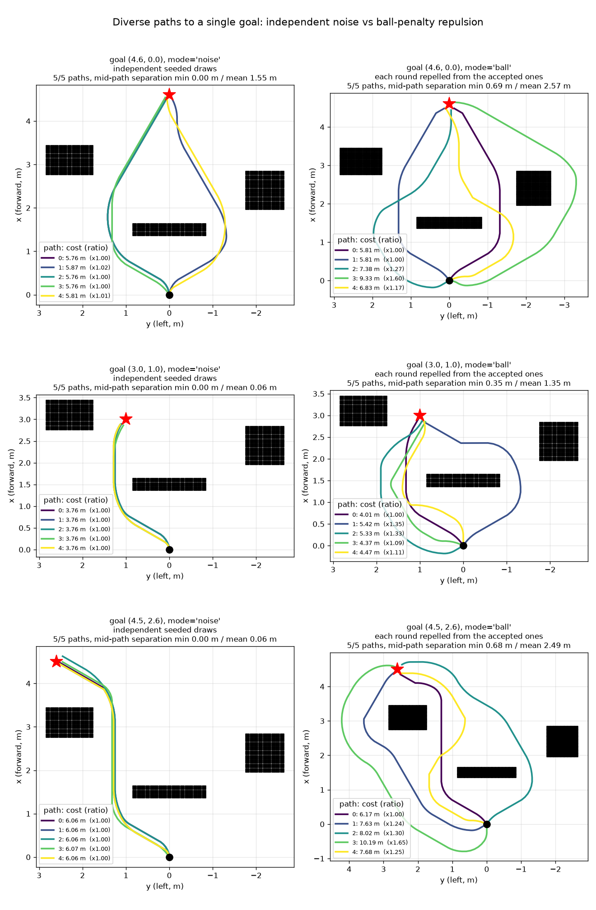
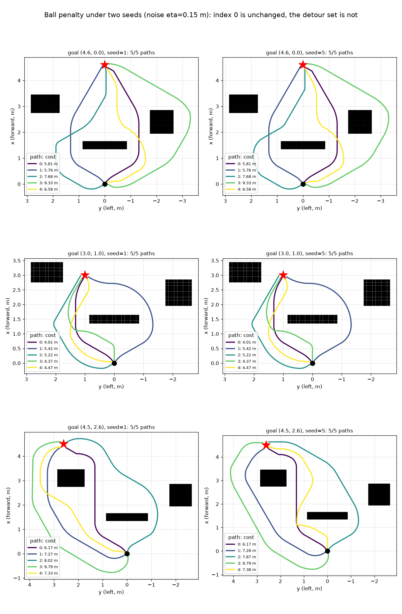

# motion-planner

A ROS-free C++ kinodynamic differential-drive **hybrid A\*** planner with
optional Python bindings.

## Installation

```bash
# system deps + submodules
sudo apt-get install -y libgoogle-glog-dev libgflags-dev libeigen3-dev liblua5.2-dev
git submodule update --init --recursive

# python deps (for the bindings + demo)
pip install pybind11 numpy matplotlib

# build (produces ./build/navigation and ./build/hybrid_astar*.so)
make
```

Make the `hybrid_astar` module importable from anywhere by copying it into the
`site-packages` of the **same interpreter you built against** (the `.so` is
ABI-tagged, e.g. `cpython-312`, so it must match). Activate that environment
first — or replace `python` below with its absolute path (e.g.
`.venv/bin/python`) — so the copy destination is that interpreter's own
`site-packages`:

```bash
python - <<'PY'
import glob, shutil, sysconfig
dst = sysconfig.get_path("purelib")
sos = glob.glob("build/hybrid_astar*.so")
assert sos, "no build/hybrid_astar*.so found — build it first (make)"
for so in sos:
    print(f"copying {so} -> {dst}")
    shutil.copy(so, dst)
PY
```

## Demo

C++ obstacle-avoidance test (writes `astar_path.csv`):

```bash
./build/navigation --test_avoidance --nav_config config/navigation.lua
```

Python demo: plans to a fan of goals around obstacles and writes `plan.png`:

```bash
python scripts/plot_plan.py
```


The same script also writes `plan_diverse.png`, comparing the two ways of getting
several paths to *one* goal (see below).

## Several paths to one goal

`plan_diverse()` returns a set of distinct paths to a single goal, for cases where
something downstream has to choose among candidates:

```python
plans = hybrid_astar.plan_diverse(cloud, goal, num_paths=5, mode="ball")
for p in plans:                    # round order; index 0 is the optimum
    p["path"]      # (N, 5) as in plan()
    p["cost"]      # arc length + turn cost, m, excluding any diversity term
    p["ratio"]     # cost relative to the cheapest path found
    p["elapsed_s"] # search time for this path
```

### Why not just re-run `plan()` with different seeds

Because independent draws cluster. Nothing tells the second draw that the first
already took a lane, so the set bunches up even though each path individually
looks perturbed. In the demo scene five noise draws come back with a **minimum
mid-path separation of 0.00 m** — they are the same path — and to the open goal
their mean separation is 0.06 m:



`mode="ball"` instead *repels*: after each path is accepted, balls are placed
along it that add cost, so the next search has to detour around its predecessors.
Separation becomes a property the set is constructed to have rather than a hoped
for side effect of randomness. On the same scene that turns 0.00 m into
0.35-0.65 m minimum and 1.4-2.5 m mean mid-path separation.

Separation is measured over the **middle 50% of arc length**, because every path
in the set shares a start pose and a goal; a whole-path metric credits
separation the candidates do not have where a choice is actually being made.

### Modes

- `"ball"` (default): the repulsion scheme above.
- `"noise"`: `num_paths` independent seeded searches, i.e. the behavior described
  in the section below. Kept for comparison.
- `"none"`: deterministic, so it yields a single path.

### Knobs

The defaults are tuned for **coverage**: fill the requested set, spread it as
widely as the scene allows, and do not spend much effort ranking the results by
length. That last part is deliberate. What makes one route better than another
here is usually semantic — terrain, exposure, whatever the downstream scorer
sees — and none of it is visible to this planner, so a longer candidate is not a
worse one and pruning against length mostly discards the detours the repulsion
just worked to find. Measured over 10 seeds with 5 requested:

| scene | paths | closest pair | spread | worst call |
|---|---|---|---|---|
| free space | 5.0 | 0.73 m | 1.62 m | 90 ms |
| open goal | 4.9 | 0.35 m | 1.43 m | 87 ms |
| wall goal | 5.0 | 0.65 m | 2.52 m | 146 ms |
| around a corner, 2.0 m lane | 4.7 | 0.37 m | 1.65 m | 536 ms |
| around a corner, 1.6 m lane | 5.0 | 0.32 m | 1.96 m | 172 ms |
| around a corner, 1.2 m lane | 4.6 | 0.39 m | 2.02 m | 102 ms |
| around a corner, 1.0 m lane | 4.9 | 0.31 m | 1.85 m | 93 ms |

"Spread" is the mean pairwise separation and "closest pair" the minimum, both
over the middle 50% of arc length. The three knobs worth reaching for:

- **`ball_weight` (default `2.0`)** — how hard paths are pushed apart, as the
  fraction by which the repulsion inflates distance cost on an accepted path.
  This is what rescues constrained scenes: through a 1.0 m lane around a corner,
  `1.0` yields 1.7 paths and `2.0` yields 4.0. Returns then stop abruptly while
  the cost does not — `2.5`, `3.0` and `4.0` all measure the same coverage at 3x,
  7x and 10x the worst-case latency.
- **`min_separation` (default `0.3` m)** — how far a path must depart from every
  earlier one to count as new; the first round that comes in under it ends the
  call. This is the fine-grained-versus-guaranteed-floor dial. At `0.3` the set
  fills in every scene above, with the closest pair 0.3-0.4 m apart in tight
  ones; at `0.5` corners give up half their candidates (5.0 -> 3.5 through a
  1.6 m lane) to buy a floor that only the uncrowded scenes were going to
  exceed anyway.
- **`suboptimality` (default `1.0`, negative disables)** — detours are capped at
  `(1 + suboptimality) x` the optimal cost, pruned *during* the search. Loose for
  the reason above, and it is not a pure giveaway to tighten: at `0.5` the same
  scenes returned fewer paths *and* took longer, since the pruning is itself
  work — free space 5.0 -> 3.0 paths and the worst call 123 ms -> 577 ms. Expect
  candidates up to ~2x the optimal length.

Second-order: `ball_radius` (default `0.6` m) is the decay length of the
repulsion and should stay under the half-width of the tightest gap the robot has
to use — at `0.9` m and above the field covers a corridor entirely, no route
avoids it, and every path after the first is a near-duplicate. `ball_spacing`
(`0.3` m) only needs to be fine enough that the balls form a continuous ridge.
Leave `weight` at `1.3`.

### Why the heuristic has to know about the repulsion

Worth knowing before changing the cost function. The A* heuristic is a wavefront
cost-to-go, and it is computed **twice**: once over plain distance, and once with
the repulsion field folded in (`Wavefront` takes an optional per-meter extra
cost, which turns its fill from a BFS into a Dijkstra). The search orders its
queue with the second and tests the suboptimality bound against the first.

Both halves matter. A heuristic blind to the repulsion underestimates the
cost-to-go by however much the remaining route must pay, which turns weighted A*
into something much closer to Dijkstra exactly where the penalty is thickest —
around a corner, where the balls cover the one usable corridor. That is a real
failure mode and not a subtle one: it used to exhaust the expansion cap on every
detour round, fall back to the half-strength retry below, and return one path
where the geometry had four. Fixing it cut mean search time from ~210 ms to
~9 ms. Conversely, testing the *length* bound with the inflated estimate would
prune nodes that are only over budget in repulsion — precisely the detours the
bound exists to allow.

The corollary is that any term added to edge costs has to be expressible as a
cost per meter, so the wavefront can carry it. This is why the ball penalty is
charged over the arc a primitive travels rather than per edge.

### Getting a different set on the same scene

The balls are a pure function of the accepted paths, so `mode="ball"` is
**reproducible by default**: same cloud and goal, same set, every call. Pass
`noise > 0` to perturb the *detour* rounds and get a different set each call.
Round 0 deliberately carries no noise, which keeps two things exact: the path the
robot wants absent any other consideration, and the cost that `suboptimality` is
measured against. Verified over 20 seed pairs at every setting below — index 0
was byte-identical in all of them.



| `noise` | detours that move >0.1 m | cost |
|---|---|---|
| 0 | 0% | — |
| 0.15 | 54% | none measurable |
| 0.25 | 94% | ~0.5 paths in the tighter scenes |
| 0.40 | — | ~0.9 paths, and the closest pair tightens |

`0.15` is what the deployment ships, and unlike the earlier starved regime where
noise cost yield outright, it now pays for itself: the 1.0 m corner lane goes
from 4.0 paths to 4.9, because a scene where one lane is marginal gets a second
look at a slightly different cost landscape.

Which detours move is a property of the scene, not just the knob, and the figure
above is a fair illustration of the spread. Reseeding barely touches the wall and
open goals (mean detour movement 0.04 m and 0.00 m) while the corner goal's set
visibly rearranges (0.80 m). Where the routes are pinned — past a wall there are
only two sides — there is little for the noise to choose between, and it is the
scenes with room to reroute that reroute. If you want the set visibly different
every cycle even in the pinned ones, `0.25` is the setting, at about half a path.

### A note on chokepoints

Where free space genuinely narrows, expect paths to share the gap: the tangent
line around an obstacle corner is the shortest feasible way through, and a wall
has only two sides. On the demo scene two pairs of paths run the identical line
through the wall gap at 0.52 m clearance, then diverge again. That is the
geometry being honest, not the penalty failing — forcing them apart there would
buy longer paths carrying no extra information. It does mean `min_separation` is
checked as "departs by at least this much *somewhere*", so a pair can share a
chokepoint and still both be returned.

Be careful about reading a collapsed set as geometry, though, because it is the
same symptom the heuristic bug above produced. A scene that returns one path is
worth a second look: raise `ball_weight`, drop `min_separation`, and see whether
the routes were there all along.

Rounds are sequential by construction, so `plan_diverse()` does no threading of
its own; parallelize across goals instead. Budget roughly 20-30 ms per path.

## Tuning path diversity of a single `plan()` call

`plan()` is deterministic and optimal by default (`noise=0`, `weight=1`). Two
optional, composable knobs make paths diverge in corridors/chokepoints instead
of collapsing onto the single optimal line, and trade greedy vs thorough search:

```python
hybrid_astar.plan(cloud, goal, seed=i, noise=0.2, weight=1.3)
```

- `noise` (eta, meters): magnitude of a smooth, seeded cost-map potential added
  to edge costs. Larger = more deviation. `0` disables it.
- `weight` (>= 1): weighted-A* heuristic factor `f = g + weight * h`. Higher =
  greedier and faster, settling on the first "good enough" route instead of the
  strict optimum.
- `seed`: fixes the noise field; same `(seed, noise, weight)` reproduces the
  exact path. Different seeds give different routes to the same goal.

To increase randomness further:

- Shorten the noise correlation length (lane width) via `kNoiseCorrLength` in
  [src/navigation/domain.h](src/navigation/domain.h) (e.g. 2.0 -> 1.0-1.5 m):
  more, finer lanes. Below ~0.5 m it degrades to jitter that discretizes away.
- Raise `noise` and/or widen the `weight` range (e.g. `U(1.3, 2.0)`).
- Vary `seed` more aggressively across runs.

Tradeoff: noise makes the search less directed, so high `noise` at `weight=1`
can exceed the expansion cap (`kMaxEdgeExpansions` in
[src/navigation/astar.h](src/navigation/astar.h)) and fail to find a path. Keep
`weight >= ~1.2` with moderate `noise` (the demo uses `noise=0.2`,
`weight~U(1.2,1.5)`), or raise the cap if you want large `noise` at `weight=1`.

## Additional details

- Run both demos from the repo root so `config/navigation.lua` resolves.
- If `make` builds the module against the wrong interpreter, reconfigure with
  `cmake -S . -B build -DPython3_EXECUTABLE=$(which python)` and rebuild.
- `plan()` takes an `(N, 2)` base_link point cloud (x forward, y left) and a
  `goal=(x, y)`, and returns an `(N, 5)` array of `x, y, theta, v, omega`.
- `plan_diverse()` takes the same cloud and goal and returns a list of per-path
  dicts; see `help(hybrid_astar.plan_diverse)` for the full signature.

### Layout

```
config/navigation.lua        # planner + grid parameters (loaded at runtime)
scripts/plot_plan.py         # Python demo
src/navigation/
  astar.h                    # generic A* search (+ bounded-suboptimality pruning)
  domain.h                   # differential-drive kinodynamic domain, diversity terms
  hybrid_planner.{h,cc}      # plan one path / a diverse set to one goal
  wavefront.{h,cc}           # obstacle-aware heuristic
  navigation_config.{h,cc}   # lua config loader
  navigation_main.cc         # C++ demo (--test_avoidance)
  python_bindings.cc         # pybind11 module `hybrid_astar`
src/{config_reader,shared}/  # AMRL submodules
```
