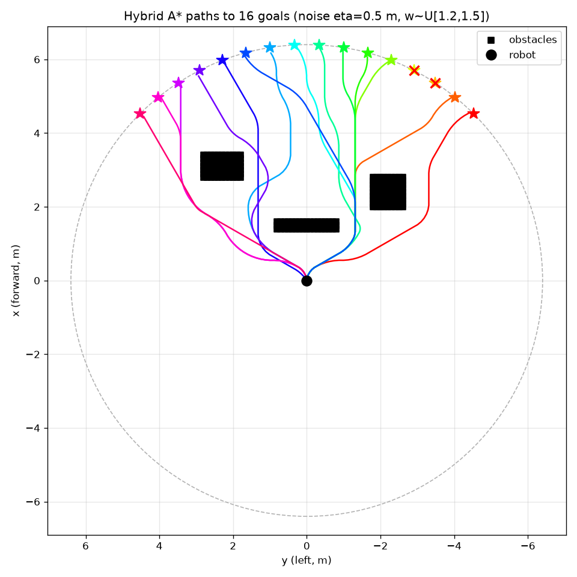

# motion-planner

A ROS-free C++ kinodynamic differential-drive **hybrid A\*** planner with
optional Python bindings.

## Installation

```bash
# system deps + submodules
sudo apt-get install -y libgoogle-glog-dev libgflags-dev libeigen3-dev liblua5.2-dev
git submodule update --init --recursive

# python deps (for the bindings + demo)
pip install pybind11 numpy matplotlib

# build (produces ./build/navigation and ./build/hybrid_astar*.so)
make
```

Make the `hybrid_astar` module importable from anywhere by copying it into the
`site-packages` of the **same interpreter you built against** (the `.so` is
ABI-tagged, e.g. `cpython-312`, so it must match). Activate that environment
first — or replace `python` below with its absolute path (e.g.
`.venv/bin/python`) — so the copy destination is that interpreter's own
`site-packages`:

```bash
python - <<'PY'
import glob, shutil, sysconfig
dst = sysconfig.get_path("purelib")
sos = glob.glob("build/hybrid_astar*.so")
assert sos, "no build/hybrid_astar*.so found — build it first (make)"
for so in sos:
    print(f"copying {so} -> {dst}")
    shutil.copy(so, dst)
PY
```

## Demo

C++ obstacle-avoidance test (writes `astar_path.csv`):

```bash
./build/navigation --test_avoidance --nav_config config/navigation.lua
```

Python demo: plans to a fan of goals around obstacles and writes `plan.png`:

```bash
python scripts/plot_plan.py
```



## Tuning path diversity

`plan()` is deterministic and optimal by default (`noise=0`, `weight=1`). Two
optional, composable knobs make paths diverge in corridors/chokepoints instead
of collapsing onto the single optimal line, and trade greedy vs thorough search:

```python
hybrid_astar.plan(cloud, goal, seed=i, noise=0.2, weight=1.3)
```

- `noise` (eta, meters): magnitude of a smooth, seeded cost-map potential added
  to edge costs. Larger = more deviation. `0` disables it.
- `weight` (>= 1): weighted-A* heuristic factor `f = g + weight * h`. Higher =
  greedier and faster, settling on the first "good enough" route instead of the
  strict optimum.
- `seed`: fixes the noise field; same `(seed, noise, weight)` reproduces the
  exact path. Different seeds give different routes to the same goal.

To increase randomness further:

- Shorten the noise correlation length (lane width) via `kNoiseCorrLength` in
  [src/navigation/domain.h](src/navigation/domain.h) (e.g. 2.0 -> 1.0-1.5 m):
  more, finer lanes. Below ~0.5 m it degrades to jitter that discretizes away.
- Raise `noise` and/or widen the `weight` range (e.g. `U(1.3, 2.0)`).
- Vary `seed` more aggressively across runs.

Tradeoff: noise makes the search less directed, so high `noise` at `weight=1`
can exceed the expansion cap (`kMaxEdgeExpansions` in
[src/navigation/astar.h](src/navigation/astar.h)) and fail to find a path. Keep
`weight >= ~1.2` with moderate `noise` (the demo uses `noise=0.2`,
`weight~U(1.2,1.5)`), or raise the cap if you want large `noise` at `weight=1`.

## Additional details

- Run both demos from the repo root so `config/navigation.lua` resolves.
- If `make` builds the module against the wrong interpreter, reconfigure with
  `cmake -S . -B build -DPython3_EXECUTABLE=$(which python)` and rebuild.
- `plan()` takes an `(N, 2)` base_link point cloud (x forward, y left) and a
  `goal=(x, y)`, and returns an `(N, 5)` array of `x, y, theta, v, omega`.

### Layout

```
config/navigation.lua        # planner + grid parameters (loaded at runtime)
scripts/plot_plan.py         # Python demo
src/navigation/
  astar.h                    # generic A* search
  domain.h                   # differential-drive kinodynamic domain
  wavefront.{h,cc}           # obstacle-aware heuristic
  navigation_config.{h,cc}   # lua config loader
  navigation_main.cc         # C++ demo (--test_avoidance)
  python_bindings.cc         # pybind11 module `hybrid_astar`
src/{config_reader,shared}/  # AMRL submodules
```
